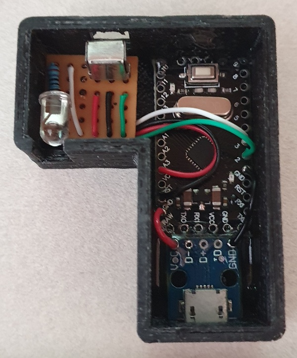

# Remote Control Translator
Translates signals from unoriginal Remote Control to your TV

## Parts
| Qty | Product                                                                  | Description             |
| --- |--------------------------------------------------------------------------|-------------------------|
|1 | [Arduino Nano](https://www.aliexpress.com/item/1005007066680464.html?spm=a2g0o.order_list.order_list_main.81.184c18028IEQMF) | Main board |
|1 | [IR LED](https://www.aliexpress.com/item/1005003852381793.html?spm=a2g0o.productlist.main.1.798c22459JzWjx&algo_pvid=85318a1a-8cc1-4731-95d6-a4eff31d04ae&algo_exp_id=85318a1a-8cc1-4731-95d6-a4eff31d04ae-0&pdp_npi=4%40dis%21ILS%212.91%212.80%21%21%210.78%210.75%21%402141122217361043205207414e152d%2112000027809445076%21sea%21IL%21140732279%21X&curPageLogUid=FTK3Pwly3RGM&utparam-url=scene%3Asearch%7Cquery_from%3A) | IR LED |
|1 | [Resistor](https://www.aliexpress.com/item/1005005721770787.html?spm=a2g0o.productlist.main.5.7bd63b830N7wP1&algo_pvid=b65c8684-58a7-443c-9943-8e9d24dbe8ac&algo_exp_id=b65c8684-58a7-443c-9943-8e9d24dbe8ac-2&pdp_npi=4%40dis%21ILS%215.62%215.36%21%21%2111.03%2110.52%21%40210123bc17361046737407515e3df5%2112000034116702774%21sea%21IL%21140732279%21X&curPageLogUid=2y1NtX77WnpY&utparam-url=scene%3Asearch%7Cquery_from%3A) | Resistor 200 Ohm |
|1 | [IR Receiver](https://www.aliexpress.com/item/32970639635.html?spm=a2g0o.order_list.order_list_main.114.184c18028IEQMF) | PC-838 |

## Notes
[IRremote Library](https://github.com/Arduino-IRremote/Arduino-IRremote) must be installed.

## Connection Diagram

